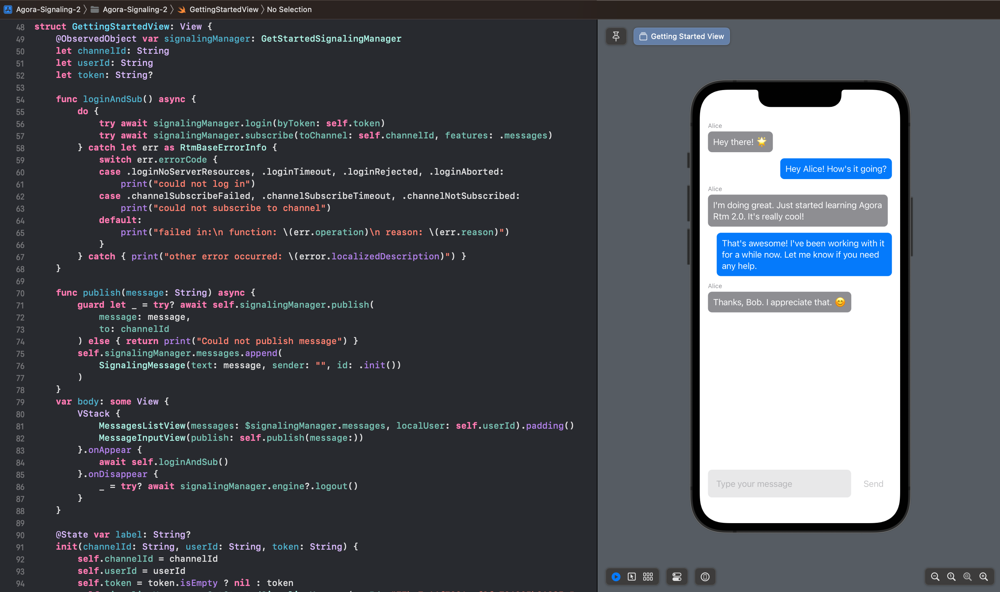

# Signaling SDK for iOS/macOS reference app

This app demonstrates the using [Agora's Signaling SDK](https://docs-beta.agora.io/en/signaling/get-started/get-started-sdk?platform=ios) for real-time communication in a SwiftUI app.

This example app is a robust and comprehensive documentation reference app for iOS and macOS, designed to enhance your productivity and understanding. It's built to be flexible, easily extensible, and beginner-friendly.

To understand the contents better, you can go to [Agora's Documentation](https://docs.agora.io), which explains each example in more detail.

- [Samples](#samples)
- [Prerequisites](#prerequisites)
- [Run this project](#run-this-project)
- [Screenshots](#screenshots)
- [Contact](#contact)

## Samples

You'll find numerous examples illustrating the functionality and features of this reference app in the root directory. Each example is self-contained in its own directory, providing an easy way to understand how to use the app. For more information about each example, see the README file within its directory.

### Get Started
- [SDK quickstart](./get-started-sdk/)
- [Secure authentication with tokens](./authentication-workflow/)

### Core Functionality

- [Stream channels](./stream-channels/)
- [Presence](./presence/)
- [Store channel and user data](./storage/)
- [Connect through restricted networks with Cloud Proxy](./cloud-proxy/)
- [Data encryption](./data-encryption/)

### Integrate Features

- [Geofencing](./geofencing/)

## Prerequisites

Before getting started with this example app, please ensure you have the following software installed on your machine:

- Xcode 14.0 or later.
- Swift 5.8 or later.

## Run this project

1. **Clone the repository**

    To clone the repository to your local machine, open Terminal and navigate to the directory where you want to clone the repository. Then, use the following command:
    
    ```sh
    git clone https://github.com/AgoraIO/signaling-sdk-samples-ios.git
    ```

2. **Open the project**

   Navigate to [Example-App](Example-App), and open [Example-App.xcodeproj](Example-App/Example-App.xcodeproj).
   
   > All dependencies are installed with Swift Package Manager, so will be fetched automatically by Xcode.

3. **Update Signing**

   As with any Xcode project, head to the target, "Signing & Capabilities", and add your team, and modify the bundle identifier to make it unique.

4.  **Modify the project configuration**

   The app loads connection parameters from the [`config.json`](./agora-manager/config.json) file. Ensure that the 
   file is populated with the required parameter values before running the application.

    - `uid`: The user ID associated with the application, or identifierForVendor to take the device ID.
    - `appId`: (Required) The unique ID for the application obtained from [Agora Console](https://console.agora.io). 
    - `channelName`: The default name of the channel to join.
    - `token`: A token generated for `uid`. You generate a temporary token using the [Agora token builder](https://agora-token-generator-demo.vercel.app/).
    - `tokenUrl`: The URL for the token generator. See [Secure authentication with tokens](./authentication-workflow) for information on how to set up a token server.

   If a valid `tokenUrl` is provided, all samples use the token server to obtain a token except the **SDK quickstart** project that uses the `token`. If a `tokenUrl` is not specified, all samples except **Secure authentication with tokens** use the `token` from `config.json`.

5. **Build and run the project**

   To build and run the project, use the build button (Cmd+R) in Xcode. Select your preferred device/simulator as the scheme.

## Screenshots

| Default Chat View |
|:-:|
|  |

## Contact

If you have any questions, issues, or suggestions, please file an issue in our [GitHub Issue Tracker](https://github.com/AgoraIO/signaling-sdk-samples-ios/issues).

